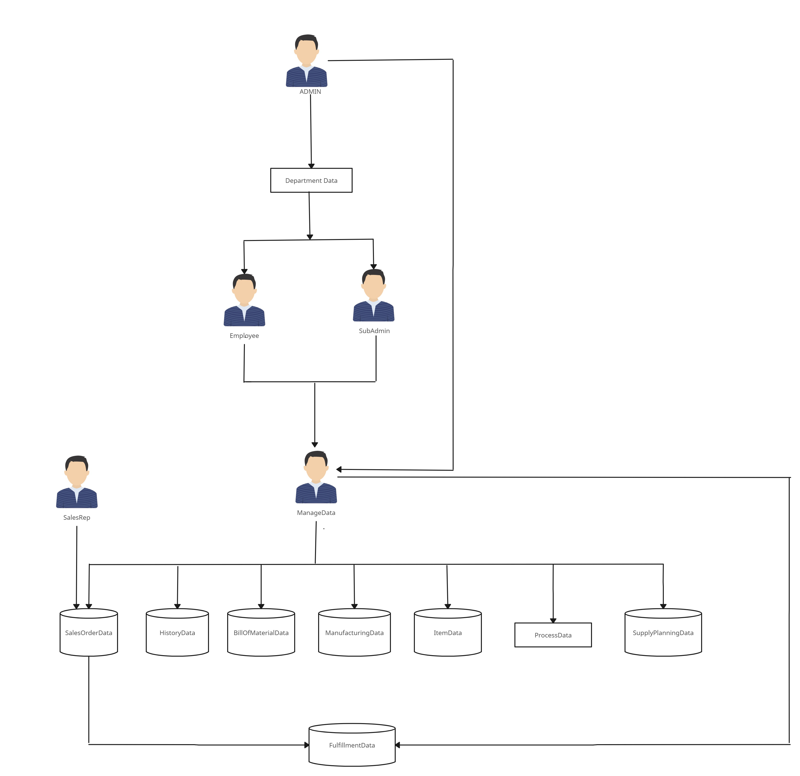
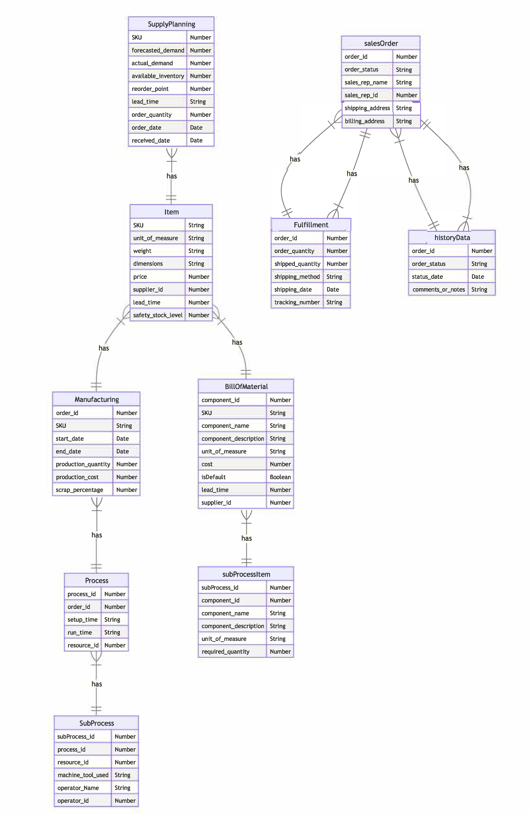

# Airbus-Aerothon 2023
# Team C.O.D.E
# [Link to the Problem Statement](https://docs.google.com/document/d/16l-kwd2kgPEODNoSkZ0Fcz7LHsiKZq5a/edit?usp=sharing&ouid=112652078616145281912&rtpof=true&sd=true)   
A Solution and approach to reduce the underlying intermediate data in the system and make the approach of departments using the data more sustainable in the long term for t:

### Deliverables
- A data lake with a normalized DB to reduce the redundancy
- An automation process for data stamping(approval) the real time data.
- A dashboard for the users in each domain to access the data required for their domain and also allow the forecast and real time data creation.
- A dashboard for the data officer to monitor the data stamping process

## Solution Approach
 
- Solution Plan for Reducing Intermediate Data in the Manufacturing Supply Chain:
- Objective:
To reduce intermediate data in the manufacturing supply chain by creating a data lake with a normalized database, identifying and eliminating redundant data, and creating dashboards for domain-specific data access and data officer monitoring.

- Solution Components:

- Data Lake: Create a centralized data repository (data lake) that will store all types of data related to the manufacturing supply chain process. The data lake will allow for easy data access and management and reduce redundancy by normalizing the database.

- Data Analysis: Conduct an analysis of the forecasted data to identify and eliminate any redundant data. This will reduce the amount of data generated and stored in the system.

- Automation of Data Stamping: Create an automation process to stamp (approve) the real-time data as it becomes available. This will ensure that the data is authentic and can be used for decision making.

- Domain-Specific Dashboards: Create dashboards for each domain to access the data required for their domain. The dashboards will allow users to access only the relevant data, reducing the amount of data they need to process and store. The dashboards should also allow users to create forecast and real-time data.

- Data Officer Monitoring Dashboard: Create a dashboard for the data officer to monitor the data stamping process. This will ensure that the data is being stamped and approved in a timely manner and that there are no delays in the manufacturing process.

- Regular Data Audits: Conduct regular audits of the data to ensure that it is accurate and up-to-date. This will help to further reduce redundancy and ensure that departments are using the most relevant and accurate data.

### Use Case
 

### Tech Stack
The platform is built using the following technologies:

- React - front-end framework
- Node.js - back-end runtime environment
- MongoDB - database management system
- Express.js - web application framework for Node.js
- JWT - JSON Web Token for authentication

### Installation
1. Clone the repository
2. Navigate to the root directory
3. Run npm install
4. Create a .env file with the following environment variables:
- PORT=3000
- MONGODB_URL=<your_mongodb_uri>
- JWT_SECRET=<your_jwt_secret>
5. Run npm start

### Contributors
- Aman Gupta
- Shashank Kumar
- Prakhar Singh
- Prarthana Agrawal
- Rajat Dixit

Built with ❤️ by Team C.O.D.E
